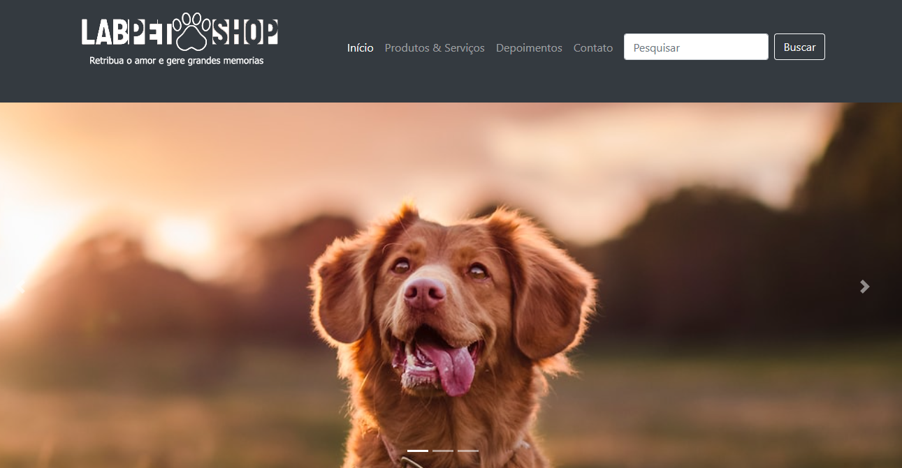

# 🐾 Lab Pet Shop - Projeto Universitário

  
  
  
  

  

## 🖥️ Demonstração

<h1 align="center">
    
</h1>

## 🔍 Sobre o Projeto

Projeto acadêmico desenvolvido para a Universidade Anhembi Morumbi, simulando um website completo para Pet Shop utilizando:

  
  
  

### ✨ Principais Funcionalidades

- **12 Produtos** com cards detalhados
- **3 Serviços** (banho, tosa, veterinário)
- Página de **contato** completa
- Seção **"Sobre Nós"**
- **Depoimentos** de clientes

## 🛠️ Tecnologias

- 
-  
- 
- 

## 📌 Seções

| Seção        | Descrição                   |
| ------------ | --------------------------- |
| 🏠 Home      | Página inicial com destaque |
| 🛍️ Produtos | 12 produtos com detalhes    |
| 🔧 Serviços  | 3 serviços oferecidos       |
| 📞 Contato   | Formulário e informações    |

## 📄 Licença

  
Consulte o arquivo [LICENSE](LICENSE) para detalhes.

---

  
  
© 2023 Lab Pet Shop (Projeto Acadêmico) Universidade Anhembi Morumbi

