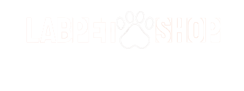
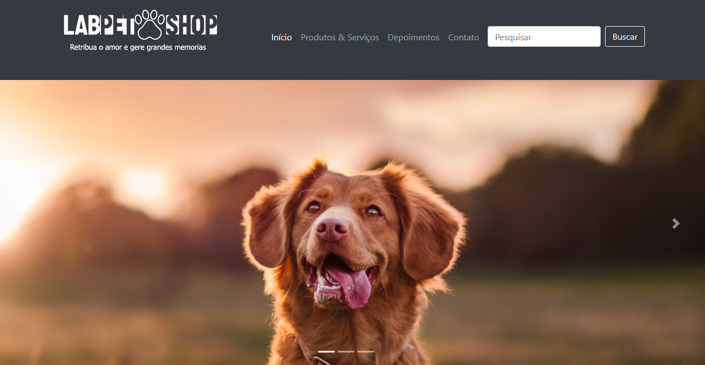

  

## 📷 Screenshots

<h1 align="center">
    
</h1>

------

📌 **Status:** Concluído

------

## 💻 Sobre o projeto

Esse projeto foi desenvolvido como parte de uma atividade proposta pela Universidade Anhembi Morumbi, com o objetivo de construir uma aplicação Web, ou seja, construir um site para um PetShop, utilizando as tecnologias HTML5, CSS3 e Bootstrap. O site inclui diversas seções, conforme as especificações da atividade.

### Especificações

- Seção de Produtos e Serviços
  - A seção de produtos e serviços deve incluir pelo menos 10 produtos e 3 serviços disponíveis no PetShop. Para isso, foi utilizada uma combinação de componentes do Bootstrap e HTML. O layout e o estilo foram definidos em um arquivo CSS externo.
- Contato da Loja
  - A seção de contato da loja deve incluir o endereço, e-mail e telefone. Essas informações foram incluídas em uma seção específica, utilizando as tags HTML apropriadas e estilo definido no arquivo CSS externo.
 - História do PetShop
    - A seção que explica a história do PetShop foi construída utilizando tags HTML apropriadas e estilo definido no arquivo CSS externo. Foi incluída uma breve história do PetShop, com o objetivo de apresentar a empresa aos clientes em potencial.
 - Depoimentos de Clientes
    - A seção de depoimentos de clientes foi incluída com o objetivo de transmitir confiança aos clientes em potencial. Foram incluídos depoimentos fictícios utilizando as tags HTML apropriadas e estilo definido no arquivo CSS externo.
  
 ---
 
 ## 🛠 Ferramentas

- [HTML5](https://developer.mozilla.org/pt-BR/docs/Web/HTML)
- [CSS3](https://developer.mozilla.org/pt-BR/docs/Web/CSS)

---

## 🎨 Framework utilizado

- [Bootstrap 4.3 CDN](https://getbootstrap.com/docs/4.3/getting-started/introduction/)

---

## 📝 License

Este projeto está licenciado sob a Licença MIT. Consulte o arquivo [LICENSE](LICENSE) para obter mais informações.

---
